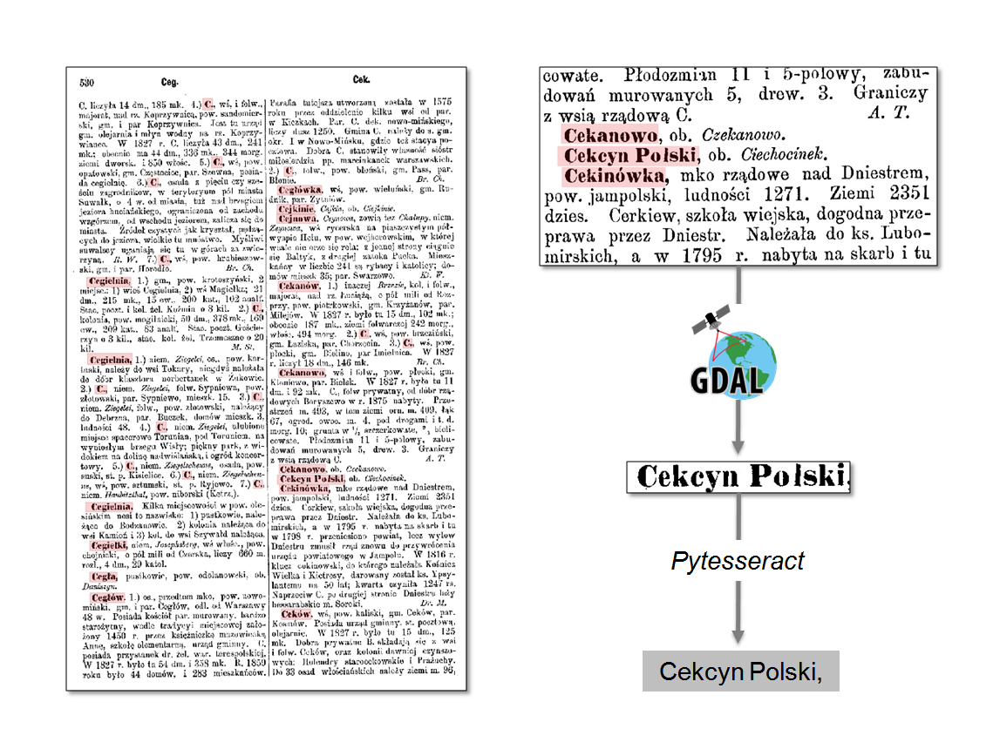

# PW_OCR


QGIS processing algorithm which recognizes text from raster images inside input polygon features and saves as attribute value of output layer.

## Python Tesseract
PW_OCR script usues [*Pytesseract*](https://github.com/madmaze/pytesseract) library and requires its installation.
After installation you have to update path to your *Tesseract* directory at the beginning of the script.
```Python
// path to your tesseract installation directory.
pytesseract.pytesseract.tesseract_cmd = 'C:\\Program Files\\Tesseract-OCR\\tesseract.exe'
```
## Algorithm



This algorithm iterates over all input polygon features and processes them according to the scheme below:
- Exporting feature as separate *shapefile* in temporary file location.
- Clipping raster overlaying the feature to the already made *shapefile* object boundaries and saving it into temporary file location (using *GDAL* library).
- Regonizing text on the clipped raster image (*Pytesseract* library)


## Parameters
<dd>
<b>Input polygon layer</b>
<dd>The features used to recognize text inside them.</dd> 
<br><b>Text output field</b>
<dd>The field in the input table in which the recognized text will be add.</dd> 
<br><b>Run for all raster layers</b>
<dd>The algorithm will recognize text from all active raster layers, if checked.</dd> 
<br><b>Input raster layer</b>
<dd>If above checkbox unchecked, the algorithm will recognize text only from this raster layer.
<br>In case of multiband raster images, the only first band will be used.</dd> 
<br><b>Page Segmentation Mode</b>
<dd><i>Tesseract</i> Page Segmentation Mode.</dd> 
<br><b>OCR Engine Model</b>
<dd><i>Tesseract</i> OCR Engine Model.</dd> 
<br><b>Remove comma</b>
<dd>If comma is the last character in recognized text, it will be removed.</dd> 
<br><b>Temporary files location</b>
<dd>Location of such transitional files like image translated to 8bit TIFF, image clipped to the single feature and shapefile contains only one feature. These files are created during iterating over all input features.</dd> 
<br><b>Output layer</b>
<dd>Location of the output layer with filled text attribute.</dd> 